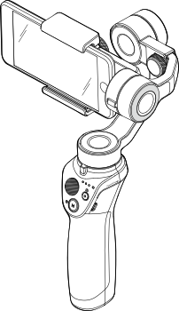

# OM Research

This repository explores the Bluetooth Low Energy (BLE) protocol used by the Osmo Mobile series of gimbals.

The official mobile apps are outdated and require broad system permissions.
However, the gimbals themselves communicate through a simple BLE protocol.

The goal of this project is to document that protocol in an open and reproducible way,
enabling the hardware to be controlled from any Bluetooth host, such as a laptop,
without relying on proprietary software.

This project is for educational and interoperability purposes only.
No proprietary software or firmware is distributed in this repository.

## Osmo Mobile 2
The Osmo Mobile 2 (OM2) is the only gimbal in the series
that can still be actuated using the official [Mobile SDK](https://github.com/dji-sdk/Mobile-SDK-Android).

The plan is to first build a minimal Android app that can discover and connect to the device,
then send rotation commands with precise, controllable parameters.
Next, develop a sniffing tool to capture and analyze the BLE traffic generated by the app.

Misc links:
- [Mobile SDK Android](https://github.com/dji-sdk/Mobile-SDK-Android)
- [SDK API Reference](https://developer.dji.com/api-reference/android-api/Components/SDKManager/DJISDKManager.html)
- [OM2 Manual](https://dl.djicdn.com/downloads/Osmo+Mobile+2/20181107/Osmo_Mobile_2_User_Manual_EN.pdf)
- [Official GO App v3](https://www.dji.com/global/downloads/djiapp/dji-go-3) 
